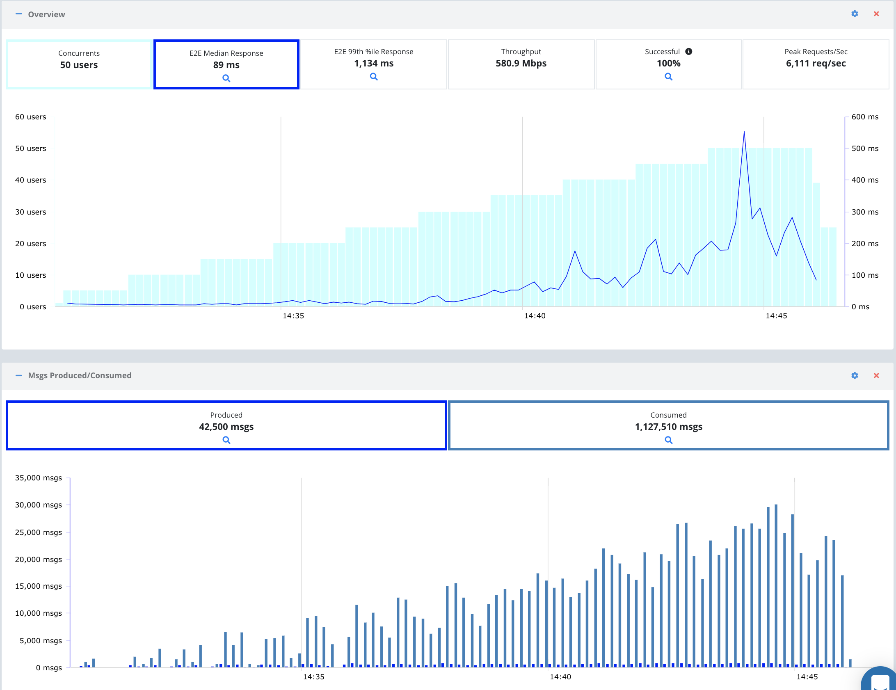

## Kafka Load Test Example

This project contains an example load test for a Kafka cluster that can be run on the Testable platform with a configurable number of topics, concurrent users, producers, consumers, message frequency, message size, etc.

In addition to standard metrics on each TCP connection to the Kafka brokers we will also capture several custom metrics to help us determine the health of our Kafka system during the test:

1. E2E Latency: Time it takes from the producer sending the message until the consumer receives the message.
2. Msgs Produced: Number of message produced both overall and grouped by topic.
3. Msgs Consumed: Number of messages consumed both overall and grouped by topic. Since there can be multiple consumers for each topic this number will be higher than the number of messages produced in most cases.

## Running Locally

To run locally you must have <a target="blank" href="https://nodejs.org/en/download/">Node.js 8.x or later.</a> Locally only 1 concurrent user will be executed.

```
./run-local.sh [kafka-bootstrap-url]
```

Any metrics captured will be output to the console as JSON.

## Running on Testable

To run on Testable you must have `curl` installed and have <a target="_blank" href="https://a.testable.io/register">created a Testable account.</a>

**Step 1:** Get a Testable API Key. 

<a target="_blank" href="https://a.testable.io/login">Login to Testable</a> and go to Organization => API Keys. Copy an API key an set it locally as the `TESTABLE_KEY` environment variable (`export TESTABLE_KEY=xxxx`).

**Step 2:** Run the load test

Check and update the parameters set in `run-testable.sh` before starting the test. This includes number of concurrent users, topics, producers, consumers, message frequency, message size, regions to generate load, instance type, etc.

```
./run-testable.sh [kafka-bootstrap-url]
```

Use the test run URL to follow progress in real-time. This example project includes a custom view (`kafka-view.json`) that will also get uploaded to Testable and set as the default for this test case. The custom view features the key metrics this test captures.

